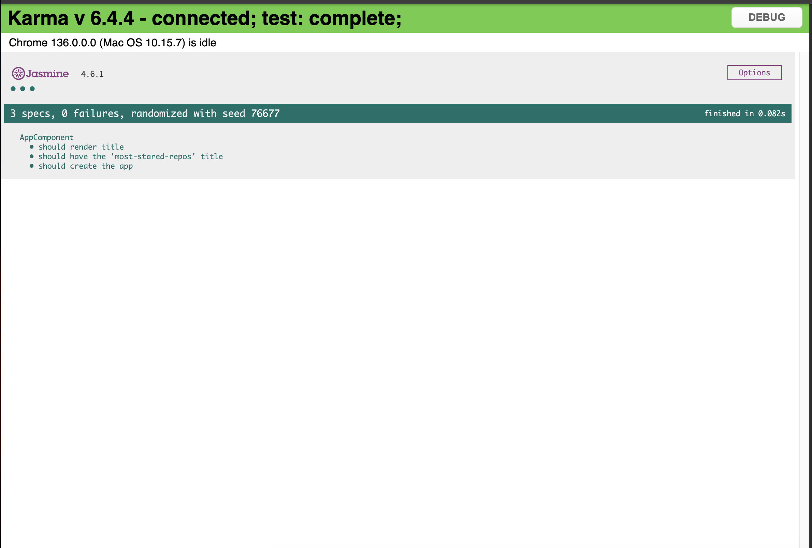
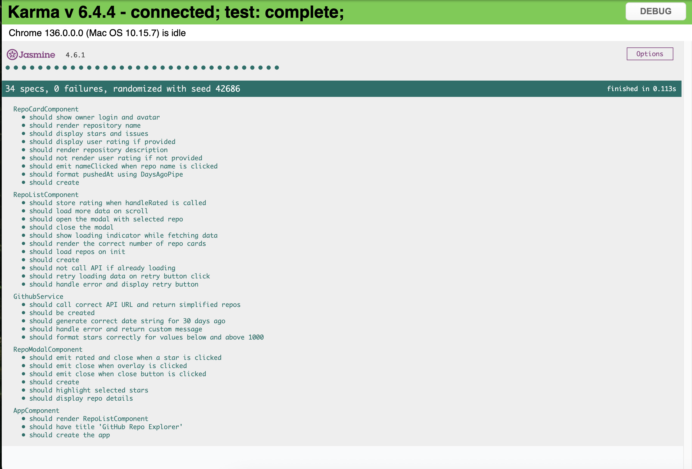

# MostStaredRepos

The Idea of this mini application is to implement a small webapp that will list the most starred Github repos that were created in the last 30 days. You'll be fetching the sorted JSON data directly from the Github API.

## Features

- Infinite scroll to load more repositories
- Repository cards showing:
  - Name (clickable)
  - Description
  - Stars
  - Issues
  - Owner info with avatar
  - Last pushed date (using custom pipe)
- Modal window for viewing detailed repo info
- Star-based (1–5) user rating system
- Retry mechanism on data fetching failure
- Unit tests for components and services

## Screenshots

### Initial Test Result



### Current Test Result



## Getting Started

### Clone the repository

```bash
git clone https://github.com/your-username/github-trending-repos.git
cd github-trending-repos
```

### Install dependencies

```bash
npm install
```

Navigate to http://localhost:4200/ in your browser.

### Run the development server

```bash
ng serve
```

### Running Tests

```bash
ng test
```


